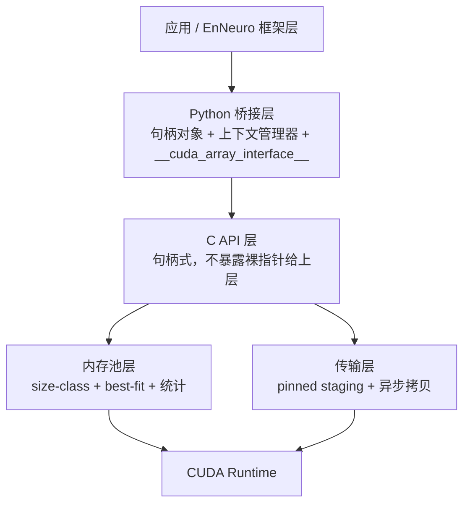
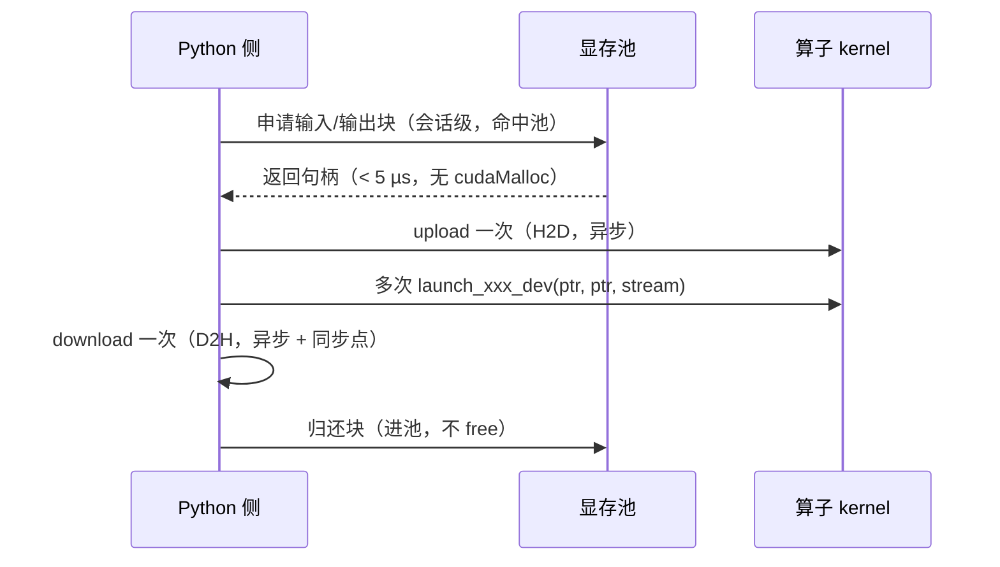

# 显存管理（方案A：自管理显存常驻）

> 本文描述方案A 的**功能需求与实现方案**（不含实现代码；可运行示例见 `code/tests/test_dev_memory.py`）。
> 配套现状见 `doc/CUDAC/算子编写与运行步骤.md`（算子改造、方案B 零拷贝实测）。

**实现进度**：阶段 1（最小可用）、阶段 2（内存池）、阶段 3（异步与流水线）已完成 → 见第十一、十二、十三节。

---

## 一、背景与定位

### 1.1 现状

`code/eneuro/cuda/` 下 13 个算子目前各有两套入口：

| 接口 | 显存归属 | 实测耗时（n=1e6, RTX 4060 Laptop） |
|------|----------|-----------------------------------|
| `launch_xxx`（host 版） | 无（每次临时分配） | 1.6 ~ 2.5 ms |
| `launch_xxx_dev`（dev 版，方案B） | cupy | 0.011 ~ 0.035 ms |

host 版慢的根因已经查清，且完全可解释：

- 每次调用都要 `cudaMalloc` × 3 + `cudaFree` × 3；实测 4 MB 块的 malloc+free **一对约 0.30 ms**
  （开销强烈依赖块大小，见 12.2 的分尺寸实测），3 对正好是 0.88 ms；
- 每次都要 H2D + D2H，实测 PCIe 往返带宽约 **5 GB/s**，n=1e6 时一个 8 MB 往返就要 1.64 ms；
- 耗时严格正比于拷贝次数（3 次拷贝 ≈ 2.4 ms，2 次 ≈ 1.6 ms，1 次 ≈ 0.85 ms），
  **与 kernel 本身的计算完全无关**。

方案B（复用 cupy 的 `data.ptr`）已经把这部分开销彻底消掉，但它有一个前提：
**显存必须由 cupy 提供**。

### 1.2 方案A 要解决的问题

方案A 是「**把显存的所有权收回自己手里**」，即：

> 由我们自己的模块负责分配、复用、传输和释放设备显存，算子在运行时只接受别人给的设备指针。

它不是为了替代方案B，而是覆盖方案B 覆盖不了的三类场景：

1. **没有 cupy 的环境**——纯 numpy 用户、精简部署包、CI 机器；
2. **需要自己控制内存布局**——融合算子的 workspace、对齐/分块要求、显存用量需要设上限；
3. **需要跨调用复用同一块缓冲**——训练循环里反复使用的中间激活区。

### 1.3 与方案B 的关系（重要）

两者**共用同一套 `launch_xxx_dev(设备指针..., stream)` 算子接口**，区别只在「谁拥有显存」：


因此方案A **不应新增任何算子签名**，否则又会走回 host 版的老路。
互通性由 `__cuda_array_interface__` 保证（已实测：`cupy.ndarray` 的指针可以直接喂给我们的 kernel；
反向也可用 `UnownedMemory` 零拷贝包装我们的 `cudaMalloc` 指针）。

### 1.4 明确不做的事（非目标）

- 不做通用深度学习内存分配器（不做自动碎片整理、不做显存超分/换出）；
- 不做多卡 P2P / NVLink 通信；
- 不做跨进程显存共享；
- 不接管用户 tensor 的生命周期——**我们只管理自己分配的那部分显存**。

---

## 二、功能需求（FR）

### FR-1 设备内存分配与释放

| 编号 | 需求 | 验收标准 |
|------|------|----------|
| FR-1.1 | 提供设备内存分配/释放原语，返回带元数据的句柄 | 可分配任意字节数并释放 |
| FR-1.2 | 分配失败必须显式返回错误 | 区分「显存不足」与其他 CUDA 错误，不崩溃、不静默返回空指针 |
| FR-1.3 | 分配按 256 B 对齐 | 便于后续向量化访存（`float4` 需 16 B，256 B 留出余量） |
| FR-1.4 | 记录每块的设备号与字节数 | 可查询任意句柄的元数据 |

### FR-2 内存池（复用，方案A 的核心价值）

| 编号 | 需求 | 说明 |
|------|------|------|
| FR-2.1 | 释放的块进入池等待复用，不立即归还驱动 | 消除热路径上的 `cudaMalloc`（约 0.25 ms/次） |
| FR-2.2 | 按 size-class 分桶，桶内 best-fit | 兼顾速度与碎片 |
| FR-2.3 | 超大块直通分配，不进池 | 见 6.1 的阈值设计 |
| FR-2.4 | 提供池统计：命中率、峰值占用、块数、碎片率 | 可输出到日志与基准脚本 |
| FR-2.5 | 提供 `trim` 接口按需归还显存 | 显存紧张时主动收缩 |
| FR-2.6 | 释放策略：立即归还 vs 延迟归还可配置 | 延迟归还避免「释放后又立刻要同一块」的抖动 |

### FR-3 主机 ↔ 设备传输

| 编号 | 需求 | 说明 |
|------|------|------|
| FR-3.1 | `upload` / `download` 原语，各有同步与异步两种 | 异步版必须接收 stream |
| FR-3.2 | 支持锁页（pinned）主机内存作为 staging | 异步拷贝的前提；pinned 分配本身很贵，必须池化 |
| FR-3.3 | 大块传输可自动分片 | 避免单次超大拷贝造成长尾与调度抖动 |
| FR-3.4 | 提供「传输与计算重叠」的最小能力（双缓冲） | 至少提供接口，不强制在算子层启用 |
| FR-3.5 | 传输失败必须上报，且不得留下半写状态 | 错误路径需可恢复 |

### FR-4 生命周期管理

| 编号 | 需求 | 说明 |
|------|------|------|
| FR-4.1 | 三级生命周期：设备级池 / 会话级 / 调用级临时 | 见 6.3 |
| FR-4.2 | 引用计数或显式 `release`，禁止裸指针游离 | 句柄失效后再次使用必须报错 |
| FR-4.3 | 必提供上下文管理器（`with` 语义），异常路径也要回收 | 保证 `finally`/析构都归还到池 |
| FR-4.4 | 双重释放必须被检测并报错 | 句柄置失效标记 |
| FR-4.5 | 进程退出时输出未释放块清单 | 泄漏自证 |

### FR-5 与算子接口对接

| 编号 | 需求 | 说明 |
|------|------|------|
| FR-5.1 | 复用现有 `launch_xxx_dev(..., stream)`，**不新增签名** | 内存管理与算子解耦 |
| FR-5.2 | 从句柄取裸设备指针是零成本操作（O(1) 查表） | 热路径不得有线性扫描 |
| FR-5.3 | 输出缓冲可由调用方指定，算子绝不隐式分配 | 保证「稳态零 `cudaMalloc`」 |
| FR-5.4 | 与现有 13 个算子全部对齐（含 `sum`/`dot` 的 `d_out` 常驻标量缓冲） | 归约结果不产生 D2H |

### FR-6 生态互操作

| 编号 | 需求 | 说明 |
|------|------|------|
| FR-6.1 | 我们管理的块实现 `__cuda_array_interface__` | 使 cupy/torch/numba 能零拷贝读取 |
| FR-6.2 | 可被 `UnownedMemory` 包装，且 owner 保活语义正确 | 已验证可行；必须防止「cupy 数组还活着但块已被池回收」 |
| FR-6.3 | 传入的 numpy 数组不做隐式 H2D | 除显式 `upload` 外一律不转换，避免悄悄产生拷贝 |
| FR-6.4 | 若 cupy 可用，支持「用户数据走 cupy、我们的 workspace 走池」的混合模式 | 见 6.4 |

### FR-7 流与并发

| 编号 | 需求 | 说明 |
|------|------|------|
| FR-7.1 | 每个块记录「最后一次被哪个流使用」 | 跨流复用前需同步或等待事件 |
| FR-7.2 | 所有涉及设备的 API 都接收 stream，默认 0（默认流） | 与现有算子签名一致 |
| FR-7.3 | 跨流复用默认关闭，需显式开启 | 默认安全优先 |

### FR-8 多设备

| 编号 | 需求 | 说明 |
|------|------|------|
| FR-8.1 | 块绑定 device id，跨设备访问**必须报错**，不得隐式拷贝 | 与 `device_ptr` 现有校验保持一致 |
| FR-8.2 | 当前设备与块设备不一致时给出明确错误信息 | 提示应包含两个设备号 |
| FR-8.3 | 池按设备隔离 | 每设备独立空闲链表 |

### FR-9 观测与诊断

| 编号 | 需求 | 说明 |
|------|------|------|
| FR-9.1 | 统计：分配次数、池命中次数、传输字节数、传输耗时 | 可直接被基准脚本消费 |
| FR-9.2 | debug 模式下做越界/溢出哨兵检查 | release 模式必须零开销 |
| FR-9.3 | 泄漏检测：未释放块清单 + 分配点信息 | 便于定位 |

### FR-10 回退与兼容

| 编号 | 需求 | 说明 |
|------|------|------|
| FR-10.1 | 无 CUDA 环境时 API 不崩，回退到主机内存 | 算子层走 CPU 实现 |
| FR-10.2 | 保留现有 host 朴素接口作为对照与兜底 | 不删除 |
| FR-10.3 | 池不可用时（首次分配失败）自动降级为直通分配 | 保证功能可用性优先于性能 |

### FR-11 线程安全

| 编号 | 需求 | 说明 |
|------|------|------|
| FR-11.1 | 池的分配/释放线程安全，锁粒度按设备划分 | 不同设备互不阻塞 |
| FR-11.2 | **不得在持锁状态下调用阻塞式 CUDA API** | 否则可能死锁 |
| FR-11.3 | Python 侧句柄表需保证 GIL 外的内存安全 | 必要时加细粒度锁 |

---

## 三、非功能需求（NFR）

| 编号 | 指标 | 目标值 |
|------|------|--------|
| NFR-1 | 池命中时的分配开销 | < 5 µs（实测 2.4 ~ 2.7 µs，且与块大小无关） |
| NFR-2 | 相对 host 接口的提速（n=1e6） | ≥ 100x |
| NFR-3 | 稳态（预热后）热路径上的 `cudaMalloc` 调用次数 | **0** |
| NFR-4 | H2D 带宽 | ≥ 基线 5 GB/s 的 85%（实测：pinned **11.8 ~ 12.4 GB/s**；pageable 8.2 ~ 10.6 GB/s） |
| NFR-5 | 与方案B 的性能差距 | 稳态下 ≤ 20%（差别只在池查找与 Python 侧开销） |
| NFR-6 | 依赖 | 仅 CUDA Runtime；Python 侧只用 `ctypes` + `numpy`，**不依赖 cupy** |
| NFR-7 | 平台 | Windows / Linux 单文件动态库 + 单个 Python 模块 |
| NFR-8 | 稳定性 | 10^6 次分配/释放循环后无泄漏、无碎片增长（空闲块数收敛） |
| NFR-9 | 代码规模 | 内存管理层不超过约 800 行 C/CUDA + 300 行 Python |
| NFR-10 | 可诊断性 | 一条命令输出池统计快照 |

---

## 四、总体设计

### 4.1 分层



### 4.2 关键设计决策

| 编号 | 决策 | 理由 |
|------|------|------|
| D1 | **C API 句柄化**，上层只拿到不透明句柄 | 防双重释放、防悬垂、便于加统计与校验；裸指针只在下发 kernel 的瞬间取出 |
| D2 | **元数据放主机侧**（句柄 → 块信息的哈希表），设备端不加块头 | 设备端加头会改变返回指针（破坏对齐）并增加一次访存；主机侧查表 O(1) |
| D3 | **池与算子解耦** | 算子是纯函数式（指针 + stream），内存策略可独立演进，也便于与方案B 共用 |
| D4 | **默认异步 + 显式同步** | 与 cupy 语义对齐；同步点由调用方决定，才能做流水线 |
| D5 | **单一所有者原则** | 一块显存同一时刻只能属于一个分配器（我们的池 *或* cupy 池），避免双重回收 |
| D6 | **默认安全、可选激进** | 跨流复用、延迟归还、超大块进池等优化默认关闭 |

---

## 五、模块设计

### 5.1 内存池

**size-class 划分**

| 区间 | 步进 / 分桶 | 策略 | 理由 |
|------|-------------|------|------|
| < 4 KB | 256 B 步进 | 桶内 best-fit | 小块最多、对内部碎片敏感 |
| 4 KB – 1 MB | 2 的幂分桶 | 桶内 best-fit，内部碎片 ≤ 2x | 覆盖绝大多数张量/激活 |
| > 1 MB | 原样大小 | 直通分配，释放后延迟缓存一段 | 复用概率低，长期占显存不划算 |

**块的生命周期**：`空闲` → `已分配` → `待回收`（延迟）→ `空闲`。

**需要暴露的统计量**：每桶块数/总字节、命中次数、未命中次数、峰值占用、碎片率
（碎片率 = 1 − 最大可服务块 / 空闲总字节）。

**收缩策略**：`trim` 按「超过 N 秒未使用」或「显存占用超过阈值」归还驱动。

### 5.2 传输子系统

- **pinned staging 池**：`cudaHostAlloc` 本身开销很大（量级与 `cudaMalloc` 相当），
  必须池化，否则异步拷贝的收益会被它吃掉；
- **异步路径**：pinned 主机缓冲 → `cudaMemcpyAsync` → 事件通知；
- **双缓冲**：两块 staging 交替，使第 k+1 批的 H2D 与第 k 批的 kernel 重叠；
- **分片**：单次拷贝超过阈值（如 64 MB）时切成多段，降低长尾。

### 5.3 三级生命周期

| 级别 | 生存期 | 典型用途 | 释放方式 |
|------|--------|----------|----------|
| 设备级池 | 整个进程 | 权重、embedding、KV cache | 显式 `trim` / 退出 |
| 会话级 | 一次 train / eval 会话 | 重复使用的中间激活区 | 上下文管理器退出 |
| 调用级临时 | 单次算子调用 | workspace、归约输出标量 | 立即归还池（**不是 free**） |

选择原则：**能在会话级分配的，不要放到调用级**——每层降级都会增加热路径开销。

### 5.4 与 cupy 共存的边界

| 场景 | 建议 |
|------|------|
| 用户数据本来就在 cupy 里 | 走方案B，零拷贝，不经过我们的池 |
| 需要长期复用的中间缓冲 | 走方案A 的会话级池 |
| 需要把我们的块交给 cupy 看 | 走 `__cuda_array_interface__` / `UnownedMemory`，**并显式保活 owner** |
| 需要把 cupy 的块交给我们 | 只借指针，不接管生命周期 |

**红线**：任何时刻一块显存只允许一个所有者负责释放。

---

## 六、关键流程

### 6.1 一次前向计算（稳态）



要点：**一次进、多次算、一次出**。这与 host 版的「每次调用都进出一遍」是本质区别。

### 6.2 训练迭代

1. 权重与优化器状态：设备级池常驻，全程不搬；
2. 每步的中间激活：会话级池复用同一块（因为形状固定）；
3. 每个算子的输出：调用方指定 `out`，不隐式分配；
4. 同步点：仅在需要读回 loss / 更新学习率时产生。

### 6.3 异常与中断路径

- 所有分配走上下文管理器；异常时归还到池而非 `free`；
- 传输失败标记该块为「内容不可信」，避免后续静默使用脏数据；
- 进程退出前打印未释放清单，作为泄漏基线。

---

## 七、性能预期与验证方法

### 7.1 预期（基于本项目实测值推算，n = 1e6）

| 方案 | 单次调用耗时 | 相对 host 提速 | 说明 |
|------|--------------|----------------|------|
| host 版 | 2.32 ~ 2.50 ms | 1x | 每次 malloc + 3 次拷贝 |
| 方案B（cupy 常驻） | 0.011 ~ 0.012 ms | ~200x | 数据本来就在显存 |
| **方案A（纯 numpy 输入）** | **约 1.7 ms** | ~1.4x | 无法避免首次 H2D（5 GB/s 上限），**单次调用场景不占优** |
| **方案A（数据已在池中，稳态）** | **0.011 ~ 0.015 ms** | **~180x** | 与方案B 基本持平 |

**关键结论**：方案A 的价值不在「单次调用更快」，而在
①**摆脱 cupy 依赖**、②**可控 workspace 与显存上限**、③**按需 upload/download 的常驻复用**。
如果一次 H2D 之后只算一次，方案A 相比 host 版几乎没有优势——**这一点必须在选型时说清楚**。

### 7.2 验证方法

| 验证项 | 方法 | 通过标准 |
|--------|------|----------|
| 稳态零分配 | 统计预热后 1000 次调用的 `cudaMalloc` 次数 | 0 |
| 池命中率 | 固定形状循环 10^5 次 | > 99% |
| 分配开销 | 计时 10^5 次池内分配 | < 5 µs/次 |
| 传输带宽 | n = 1e6/1e7 的 H2D/D2H 计时 | ≥ 4.2 GB/s（基线 5 GB/s 的 85%） |
| 长时间稳定性 | 10^6 次分配/释放 | 空闲块数收敛、无泄漏 |
| 正确性 | 与 numpy 参考逐一比对（沿用现有脚本） | 全部通过 |
| 互操作 | 池块被 cupy 零拷贝包装后读写一致 | max\|diff\| = 0 |

---

## 八、风险与对策

| 风险 | 后果 | 对策 |
|------|------|------|
| 显存泄漏 | 训练后期 OOM | RAII + 上下文管理器 + 退出清单 + 泄漏检测 |
| 碎片积累 | 明明有空闲却分配失败 | size-class + 大块直通 + 碎片率指标 + `trim` |
| 跨流复用竞态 | **静默算错**（最危险） | 默认关闭跨流复用；开启时用事件同步；debug 模式加流校验 |
| 与 cupy 池冲突 | 双重回收 / 悬垂 | 单一所有者原则 + 显式 `UnownedMemory` 边界 |
| 双重释放 | 崩溃或静默破坏他块数据 | 句柄失效标记 |
| 设备不匹配 | 崩溃或写错显存 | 块绑定 device id + 调用前校验（沿用现有 `device_ptr` 模式） |
| pinned 内存分配慢 | 异步收益被吃掉 | pinned staging 必须池化 |
| 过度设计 | 复杂度失控、bug 面大 | 严格守住「非目标」清单；NFR-9 限制代码规模 |

---

## 九、分阶段实施计划

| 阶段 | 内容 | 验收标准 | 预估 |
|------|------|----------|------|
| **阶段 1：最小可用** ✅ | 句柄式分配/释放 + 直通分配（无池）+ 同步传输原语 + Python 侧上下文管理器 | 可与现有 13 个 `*_dev` 算子对接，纯 numpy 环境下跑通全流程 | 小 |
| **阶段 2：内存池** ✅ | size-class 分桶 + best-fit + 统计 + `trim` | 稳态 `cudaMalloc` 次数为 0；命中率 > 99% | 中 |
| **阶段 3：异步与流水线** ✅ | pinned staging 池 + 异步拷贝 + 事件 + 双缓冲 | 传输带宽达基线 85%；双缓冲下 H2D 与 kernel 重叠 | 中 |
| **阶段 4：互操作** | `__cuda_array_interface__` + `UnownedMemory` 边界 + 混合模式文档 | 池块被 cupy 零拷贝包装后读写一致 | 小 |
| **阶段 5：多设备与并发** | 池按设备隔离 + 流记录 + 线程安全 | 双卡场景下无跨设备误用 | 中 |

**建议**：若短期只需「不依赖 cupy 也能跑」，做完**阶段 1 + 阶段 2** 即可，阶段 3–5 按需推进。

---

## 十、验收清单

- [ ] 13 个算子在方案A 下全部正确（与 numpy 参考逐一比对）
- [ ] 稳态热路径 `cudaMalloc` 调用次数为 0
- [ ] 池命中时分配开销 < 5 µs
- [ ] H2D/D2H 带宽 ≥ 4.2 GB/s
- [ ] 10^6 次分配/释放无泄漏、空闲块数收敛
- [ ] 无 CUDA 环境下 API 不崩（FR-10.1）
- [ ] `__cuda_array_interface__` 与 cupy 零拷贝互通正确
- [ ] 所有失败路径有明确错误信息（含设备号、字节数、请求来源）
- [ ] 基准脚本可一键输出方案A / 方案B / host 三方对比与柱状图
- [ ] 文档更新：算子编写步骤、显存管理（本文）

---

## 十一、阶段1 实现说明（已完成）

### 11.1 交付物

| 文件 | 作用 |
|------|------|
| `code/eneuro/cuda/cu/dev_memory.cu` | C 层：无状态薄封装（`cudaMalloc/Free/MemcpyAsync` + 错误码 + 计数），编译为 `dev_memory.dll` |
| `code/eneuro/utils/dev_memory.py` | Python 层：`DeviceBuffer` 句柄 / `DeviceAllocator` 块表与生命周期 / 异常体系 / 统计与泄漏报告 |
| `code/eneuro/utils/cuda_ops.py`（扩展） | `device_ptr()` 现同时接受 `DeviceBuffer` —— 13 个 `*_dev` 算子**一行未改**即可跑在方案A 的显存上 |
| `code/tests/test_dev_memory.py` | 验收测试，同时也是可运行的用法示例 |

### 11.2 C API 一览

| 导出 | 作用 |
|------|------|
| `ene_mem_init(device)` | 初始化；无设备时返回 `ENE_ERR_NODEVICE`（供上层回退） |
| `ene_mem_available()` / `ene_mem_device()` / `ene_mem_device_count()` | 能力查询 |
| `ene_mem_alloc(size)` / `ene_mem_free(ptr)` | 直通分配/释放 |
| `ene_mem_upload(d, h, bytes, stream)` / `ene_mem_download(h, d, bytes, stream)` | 传输（阶段1 为同步语义：内部 Async + StreamSynchronize） |
| `ene_mem_sync(stream)` | 等待流完成 |
| `ene_mem_last_code()` / `ene_mem_last_error()` / `ene_mem_error_string(code)` | 错误信息（按线程保存） |
| `ene_mem_alloc_calls()` 等 4 个计数 | 供基准脚本验证「稳态零分配」 |

错误码：`ENE_OK` / `ENE_ERR_OOM`（显存不足）/ `ENE_ERR_INVALID`（参数非法）/ `ENE_ERR_DEVICE`（设备号非法）/ `ENE_ERR_CUDA`（其他）/ `ENE_ERR_NODEVICE`（无设备）。

### 11.3 Python API 一览

| 对象 | 关键成员 |
|------|----------|
| `DeviceAllocator(device=0, lib_dir=None, force_host=False)` | `alloc(size, dtype=float32, name=)` / `alloc_bytes(n)` / `alloc_like(ndarray)` / `sync()` / `stats()` / `leak_report()` / `close()` / `with` 语义 |
| `DeviceBuffer` | `ptr`（取裸指针，已释放会报错）/ `size` / `nbytes` / `dtype` / `device` / `upload(arr)` / `download(arr)` / `to_numpy()` / `release()` / `with` 语义 |
| 异常 | `DevMemError` → `OutOfMemoryError` / `InvalidArgumentError` / `DeviceError` / `BufferReleasedError` / `AllocatorClosedError` |

### 11.4 与设计的差异（阶段1 的取舍）

| 设计条目 | 实际做法 | 原因 |
|----------|----------|------|
| D1「C API 句柄化」 | 句柄化落在 **Python 层**（`DeviceBuffer`），C 层仍暴露裸指针 | C 层保持无状态，代码量小一个数量级；块表用 Python dict 天然 O(1)。C 层不面向最终用户，只被 `dev_memory.py` 调用 |
| FR-1.3 256B 对齐 | 不做额外对齐分配，只做自检兜底 | `cudaMalloc` 本身保证 ≥256B 对齐（已在测试中验证） |
| FR-4.2 引用计数 | 用「块表 + released 标记 + `__del__` 兜底」代替 | 足够防悬垂与双重释放，且无循环引用风险 |

### 11.5 验收结果

`python code/tests/test_dev_memory.py`（脚本在导入 eneuro 前屏蔽了 cupy，因此跑通即证明 NFR-6）

| 组别 | 结果 |
|------|------|
| [1] 分配/释放/对齐/往返 | 8/8 |
| [2] 错误路径 | 13/13 |
| [3] 13 个算子全流程 | 13/13 正确 |
| [4] 统计与泄漏报告 | 8/8 |
| [5] 无 CUDA 回退 | 5/5 |

性能（n = 1e6，RTX 4060 Laptop）：

| 场景 | 单次耗时 | 说明 |
|------|----------|------|
| host 接口（malloc + 3 次拷贝） | 2.5391 ms | 每次都要进出显存 |
| 方案A 单次（上传+算+下载） | 1.6568 ms | 同样受 H2D/D2H 带宽限制 |
| **方案A 复用常驻缓冲（只算）** | **0.0103 ms** | 数据已在显存，只跑 kernel |

实测印证了第七节的结论：**方案A 单次调用只比 host 快约 1.5 倍**（省掉的是 `cudaMalloc/cudaFree`），
真正 247 倍的提升来自「一次进、多次算、一次出」。

### 11.6 已知限制（留给后续阶段）

- 每次 `alloc` 仍是一次 `cudaMalloc`（阶段 2 的池会消掉，NFR-3 尚未达成）；
- 传输是同步语义，无 pinned staging、无双缓冲（阶段 3）；
- 未实现 `__cuda_array_interface__`，暂不能与 cupy/torch 零拷贝互通（阶段 4）；
- C 侧计数器未加锁、块表未按设备隔离、跨流复用未处理（阶段 5）。

---

## 十二、阶段2 实现说明（已完成）

### 12.1 交付物

**无新增文件**，全部落在 `code/eneuro/utils/dev_memory.py`；`dev_memory.cu`（C 层）**一行未改**——
内存池是 Python 层的实现细节，直接复用阶段1 的 `ene_mem_alloc/free`。

新增内容：`_size_class()` 分桶函数、`DeviceAllocator` 的池化逻辑与三个新参数、
`trim()` / `free_blocks` / `DeviceBuffer.capacity`、`stats()` 的池字段。

### 12.2 分桶策略（含对 5.1 节的一处修正）

| 区间 | 5.1 节原设计 | 实际实现 | 内部碎片 |
|------|--------------|----------|----------|
| ≤ 4 KB | 256 B 步进 | ✅ 同 | ≤ 255 B |
| 4 KB ~ 1 MB | 2 的幂分桶 | ✅ 同 | ≤ 2x |
| > 1 MB | 直通，不进池 | **按精确大小分桶，进池** | 0 |

**修正理由来自实测**（`pool=False` 时一次 malloc+free 的耗时）：

| 块大小 | 不池化 (us) | 池命中 (us) | 提速 |
|--------|-------------|-------------|------|
| 4 KB | 4.36 | 2.42 | 1.8x |
| 64 KB | 4.59 | 2.45 | 1.9x |
| 1 MB | 5.80 | 2.48 | 2.3x |
| **4 MB** | **300.09** | **2.41** | **124.7x** |

驱动的 caching allocator 对 ≤ 1 MB 的块缓存得很好（~5 us），但 **4 MB 的块每对 malloc/free 要 300 us**。
如果按原设计把 > 1 MB 直通，那么典型尺寸的激活张量（常在 1 ~ 16 MB）每个训练步都要付这 300 us——
在 10 ms 级的训练步里就是 3%。而「大块长期占显存」这个原设计想解决的问题，
改用 `pool_max_bytes` 上限 + `trim(older_than=)` 解决，比一刀切更精细。
需要旧行为时传 `pool_max_block=1<<20` 即可。

### 12.3 新增 API

| 参数 / 成员 | 说明 |
|-------------|------|
| `pool=True` | 关掉即退化为阶段1 的直通分配（每次 cudaMalloc） |
| `pool_max_block=None` | 超过此容量不进池；传 `1<<20` 即设计文档原行为 |
| `pool_max_bytes=None` | 池中空闲字节上限，超出按 **FIFO** 驱逐最旧的（FR-2.6） |
| `trim(older_than=None)` | 归还池中空闲块给驱动；`older_than=30` 只归还已空闲 30 s 以上的（FR-2.5） |
| `free_blocks` | 当前池中空闲块列表 |
| `DeviceBuffer.capacity` | 实际占用显存字节数（≥ `nbytes`，差额是内部碎片） |
| `stats()` | 新增 `pool_hits` / `pool_misses` / `hit_rate` / `free_blocks` / `free_bytes` / `largest_free_block` / `fragmentation` / `evicted_blocks` / `trimmed_blocks` / `free_classes`（FR-2.4） |

### 12.4 四个关键实现细节

1. **复用时不改旧 `_BlockInfo`，而是新建一个**。若就地把旧块信息改回可用，
   旧的 `DeviceBuffer` 句柄会重新「活过来」并指向新块——典型悬垂别名 bug。
   测试 [6] 专门验证了「地址被复用后旧句柄仍然报错」。
2. **快路径完全不碰 CUDA**：命中时只有一次 dict 查找 + pop + 新建元数据对象。
3. **不在持锁时调用 `cudaFree`**（FR-11.2）：`_release` 在锁内只做记账与挑选，
   真正 free 放到锁外；`trim` 与驱逐同理。
4. **`_BlockInfo` 用 `eq=False`**：让 `list.remove` 走身份比较，
   避免字段相同的块被误删。

### 12.5 验收结果

`python code/tests/test_dev_memory_pool.py`（同样在导入 eneuro 前屏蔽了 cupy）

| 组别 | 项数 |
|------|------|
| [1] 池命中与指针复用 | 4/4 |
| [2] 稳态零 cudaMalloc | 3/3 |
| [3] 分配/归还开销 + 分尺寸对照 | 1/1 |
| [4] size-class 分桶（10 个尺寸） | 10/10 |
| [5] 大块按精确大小分桶 | 2/2 |
| [6] 复用后旧句柄失效 | 5/5 |
| [7] trim | 7/7 |
| [8] pool_max_bytes 驱逐 | 4/4 |
| [9] pool=False 等价阶段1 | 3/3 |
| [10] 长时间稳定性（20 万次循环） | 3/3 |
| [11] 13 个算子跑在池化显存上 | 4/4 |
| [12] close 归还池块 | 3/3 |

指标达成情况：

| 指标 | 目标 | 实测 |
|------|------|------|
| NFR-3 稳态 cudaMalloc 次数 | 0 | **0**（2 万次循环，预热后增量为 0） |
| 池命中率 | > 99% | **99.99%** |
| NFR-1 分配开销 | < 5 us | **2.4 ~ 2.7 us**，与块大小无关 |
| NFR-8 长时间稳定 | 无泄漏、空闲块收敛 | 20 万次后 `live_blocks=0`、`free_blocks=1` |

### 12.6 已知限制（留给后续阶段）

- 池未按设备隔离、统计未加锁（阶段 5）；
- **跨流复用未处理**：块被 A 流释放后可能立刻被 B 流复用，而 A 流上还有未完成的 kernel。
  目前唯一的安全前提是**单流**（对应 FR-7.3「跨流复用默认关闭」）；
- `trim(older_than=)` 需调用方自行定期触发，未内置后台清理；
- 未实现 `__cuda_array_interface__`（阶段 4）。

---

## 十三、阶段3 实现说明（已完成）

### 13.1 交付物

| 文件 | 变更 |
|------|------|
| `code/eneuro/cuda/cu/dev_memory.cu` | 新增流 / 事件 / pinned / 异步传输共 13 个导出 |
| `code/eneuro/utils/dev_memory.py` | `PinnedBuffer` + pinned 池 + `upload_async`/`download_async` + 流与事件 API + `DoubleBuffer` |
| `code/eneuro/utils/cuda_ops.py` | **修了一个 bug**（见 13.3） |
| `code/tests/test_dev_memory_async.py` | 新增验收测试（11 组） |

### 13.2 新增 API

| C 层 | 作用 |
|------|------|
| `ene_mem_stream_create/destroy` | 非阻塞流（`cudaStreamNonBlocking`） |
| `ene_mem_event_create[_timed]/destroy/record/wait/sync/done/elapsed` | 跨流同步 + GPU 侧计时 |
| `ene_mem_host_alloc/free/is_pinned` | 锁页主机内存 |
| `ene_mem_upload_async` / `ene_mem_download_async` | **纯异步**，不含任何同步 |
| `ene_mem_host_alloc_calls` | pinned 分配计数（验证池化生效） |

| Python 层 | 作用 |
|-----------|------|
| `DeviceBuffer.upload_async(arr, stream=)` | 异步 H2D；pageable 源自动走 pinned staging |
| `DeviceBuffer.download_async(arr, stream=)` | 异步 D2H；**目标必须锁页**，否则报错 |
| `DeviceAllocator.pinned(size, dtype=)` | 取锁页内存，`.array` 是零拷贝 numpy 视图 |
| `DeviceAllocator.new_stream/destroy_stream` | 非阻塞流 |
| `DeviceAllocator.create_event/record_event_on/wait_event/event_sync/event_done/event_elapsed` | 事件原语 |
| `DeviceAllocator.sync(stream=)` | 同步该流并回收已完成的 staging |
| `DeviceAllocator.double_buffer(size, slots=2)` | 双缓冲流水线 |
| `chunk_bytes` 构造参数 | 大块传输自动分片（FR-3.3） |

### 13.3 一个被测试抓出来的真 bug

`cuda_ops.stream_ptr()` 原来是这样：

```
if cp is None: return 0        # cupy 不可用 -> 直接把流丢掉
```

而 cupy 不可用正是方案A 的典型场景。后果是 **kernel 全部落在默认流上**：
双缓冲永远不可能重叠，而且[「在自定义流上跑算子」的测试也只是假通过]。
已修成「int 原样透传」（cupy 的流对象仍走 `.ptr`），不改变方案B 的行为。

### 13.4 同步语义的变化（兼容性）

| 接口 | 阶段1/2 行为 | 阶段3 |
|------|--------------|--------|
| `upload` / `download` | 同步（返回即完成） | **语义未变**（保持向后兼容） |
| `upload_async` / `download_async` | — | 只入队；用前必须 `sync()` 或依赖同流顺序 |
| 跨流 | 不涉及 | 需调用方用事件显式建立依赖 |

异步是**新增**接口而非改默认行为，所以阶段1/2 的代码不会静默变错。

### 13.5 验收结果

`python code/tests/test_dev_memory_async.py`（同样屏蔽 cupy）

| 组别 | 项数 |
|------|------|
| [1] pinned 分配 / 视图读写 / 池复用 / 旧句柄失效 | 10/10 |
| [2] 异步上传下载（pageable 源 + pinned 源） | 4/4 |
| [3] 传输带宽对照（NFR-4） | 2/2 |
| [4] 大块自动分片 | 2/2 |
| [5] 事件 record / wait / elapsed / done | 4/4 |
| [6] 双缓冲重叠（FR-3.4） | 1/1 |
| [7] 在飞 pinned 有界 | 5/5 |
| [8] download_async 目标必须锁页 | 2/2 |
| [9] 13 个算子跑在自定义流上 | 1/1 |
| [10] 主机回退模式 | 5/5 |

关键实测（n = 4M float = 16 MB，取多轮中最快一轮）：

| 指标 | 结果 |
|------|------|
| H2D 带宽：同步 / pageable | 8.2 ~ 10.6 GB/s（波动较大） |
| H2D 带宽：同步 / pinned | **11.8 ~ 12.4 GB/s（稳定）** |
| H2D 带宽：异步 / pinned | 12.0 ~ 12.3 GB/s |
| H2D 带宽：异步 / pageable（走 staging） | 5.3 ~ 5.9 GB/s（**最慢**） |
| pinned 池效果 | 60 次异步上传只发生 **2 次** `cudaHostAlloc` |
| 双缓冲重叠（pinned 源） | **1.22 ~ 1.37x** |
| 双缓冲（pageable 源，需 staging） | **0.81 ~ 1.15x（明显更低且不稳定）** |

> **两个容易搞反的点**：
> 1. **异步本身不提高纯传输带宽**（12.0 ~ 12.3 与同步 pinned 的 11.8 ~ 12.4 基本持平）。
>    它的价值是「传输能与计算重叠」，不是「传得更快」。
> 2. **带宽提升来自 pinned，不来自异步**（pageable 8.2 ~ 10.6 → pinned 11.8 ~ 12.4，约 **1.2 ~ 1.4x**）。

### 13.6 一个重要发现：重叠需要源数据本来就在 pinned 内存里

pageable 源做异步 H2D 时，必须先把它 `memmove` 进 pinned staging —— 这段是**纯主机开销**
（8 MB 约 0.5 ~ 0.8 ms/chunk），而且与 GPU 工作在抢同一段时间。

后果是重叠收益大幅缩水，**且方向不稳定**：

| 源 | 双缓冲收益（多次测量） |
|----|------------------------|
| pinned（生产者直接写 `pin.array`） | **1.22 ~ 1.37x**，稳定 |
| pageable（需要 staging 中转） | **0.81 ~ 1.15x**，可能反而更慢 |

所以「随手指一个 numpy 数组再指望异步流水线」是不行的；正确用法是让生产者
**直接写进 pinned staging**：

```
pin = mem.pinned(n, dtype=np.float32)
... 生产者直接写 pin.array ...        # 没有额外拷押
slot.upload_async(pin.array)          # 直直接 DMA，无主机侧中转
```

### 13.7 完整对比与柱状图

```bash
python code/tests/bench_dev_memory_pipeline.py
```

三面板柱状图：`doc/CUDAC/cu_async_pipeline_bar.png`

| 面板 | 内容 |
|------|------|
| 实验 A | 传输方式对带宽的影响（同步/异步 × pageable/pinned，5 种组合） |
| 实验 B | 端到端耗时（串行 vs 流水线 pinned 源 vs pageable 源） |
| 汇总 | 相对各自基线的加速比 |

**测量提醒**：标定 kernel 耗时**必须先预热一次 launch** —— 首次 launch 会加载 CUDA 模块
（本机约 20 ms），不预热会把这一性开销平均进 20 次循环，得出「kernel 要 1 ms」的假数据
（真实值约 17 ~ 23 us，相差约 50 倍）。`bench_dev_memory_pipeline.py` 与
`test_dev_memory_async.py` 都已加上预热。

### 13.8 已知限制

- 池的**跨流复用**仍未防护（阶段 5）；`DoubleBuffer` 内部已用事件保证了槽位安全；
- 只有一条 copy 流，多个 chunk 的拷贝彼此串行 → 重叠收益上限是
  `(拷贝+计算) / max(拷贝,计算)`，本机实测约 **1.3x**（已接近两条流各自满负荷）；
- `download_async` 要求 pinned 目标（刻意的：pageable 目标的异步 D2H 实际不会异步）；
- 未实现 `__cuda_array_interface__`（阶段 4）。

---

## 附：方案 A / B 选型速查

| 你的情况 | 推荐 |
|----------|------|
| 数据本来就在 cupy 里，且不介意依赖 cupy | **方案B**（零成本，已实现） |
| 需要长期复用的中间缓冲 / workspace | **方案A 会话级池** |
| 部署环境没有 cupy | **方案A** |
| 需要限制显存用量上限 | **方案A** |
| 一次 H2D 只算一次 | **都不划算**——先考虑合并算子减少往返 |
| 不确定 | 先按方案B 接，把内存策略留成接口；真有需求再上方案A |
